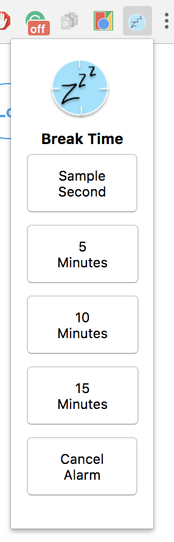

# BreakTime

This simple Google Chrome extension allows the user to select a duration of time for break and get reminded when the break is over.

## How It Works
The user starts their break by selecting a time in the popup menu.

Then, the user will be reminded with a notification when their break is over.

The user can click `Close` or ignore the notification for it to disappear. The user can also choose to extend their break by clicking `More` and then `Extend break`.

## Project Info

This project is part of 50 days of Google Chrome extensions.
